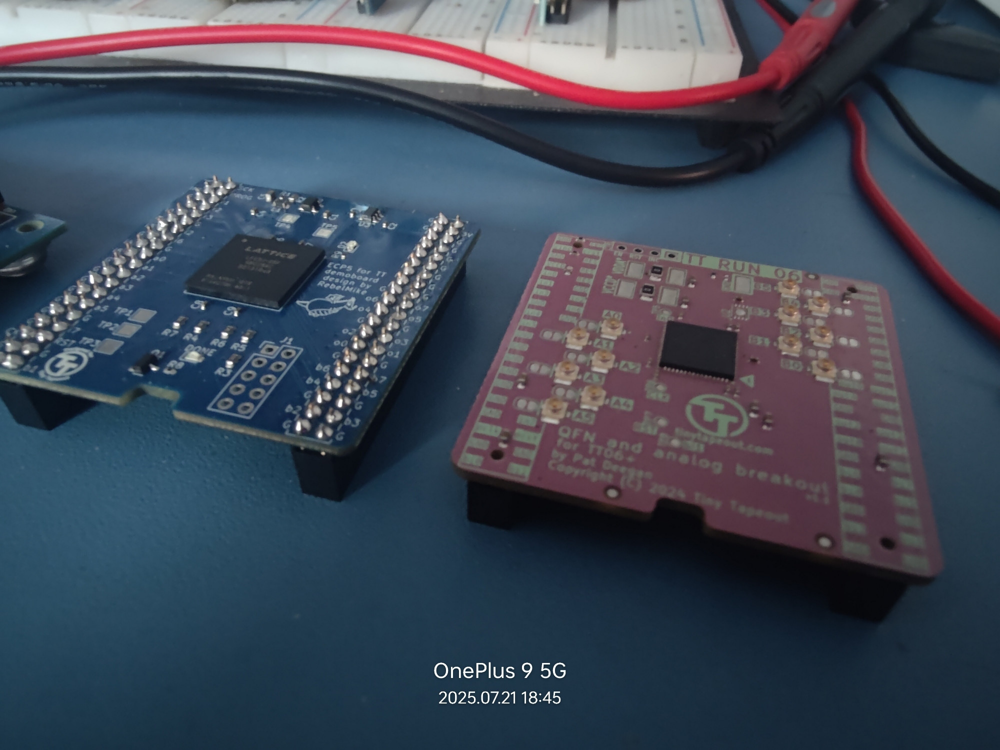
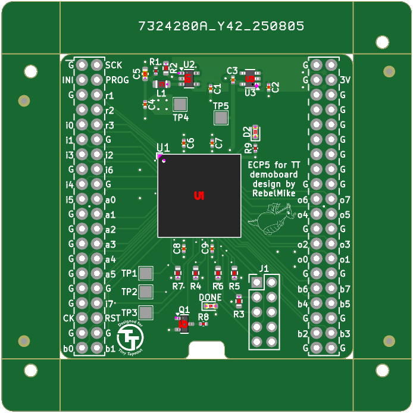
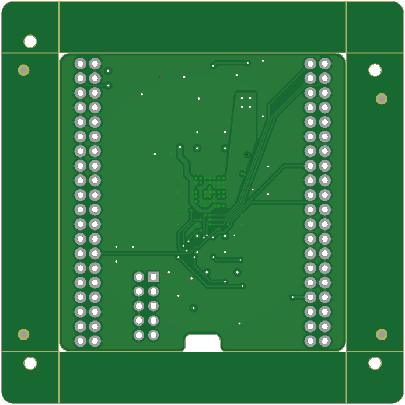

# ecp5-fpga-breakout
Gerbers, BOM and designators for TinyTapeout ECP5 FPGA breakout board.

## Credits
 This PCB was created by Michael Bell, also known as Mike Bell, from the TinyTapeout community. The purpose of this repository is to offer ready-to-fabricate Gerber files along with the necessary component placement for his design.
 

  

<em>FPGA brother(blue PCB) to TinyTapeout ASIC</em>

  

<em>Top Assembly of PCB</em>

  

<em>Botttom of PCB</em>

